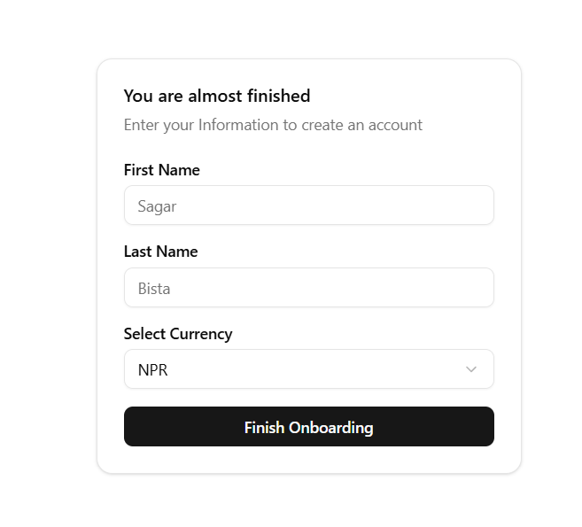
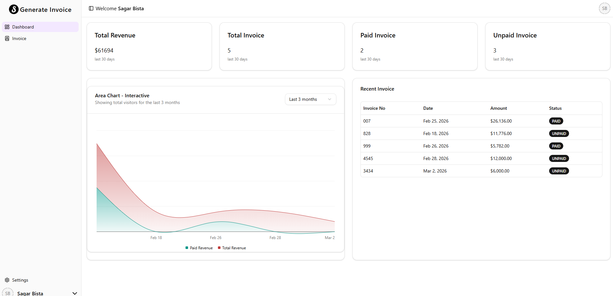
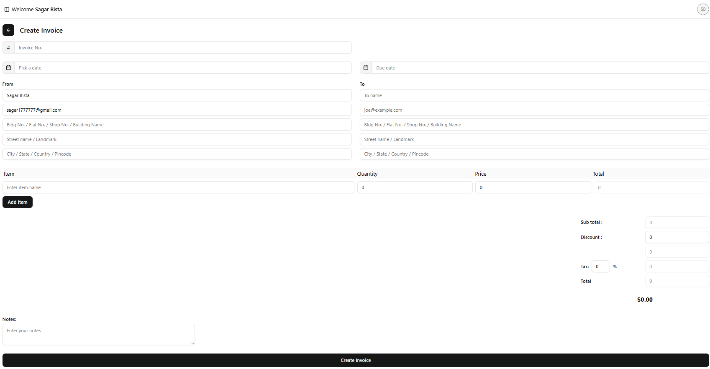
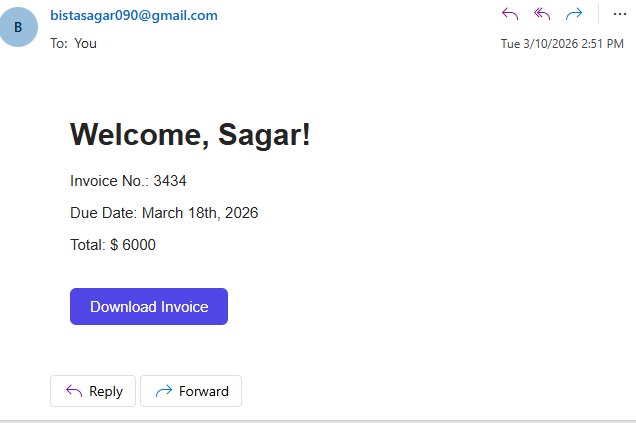
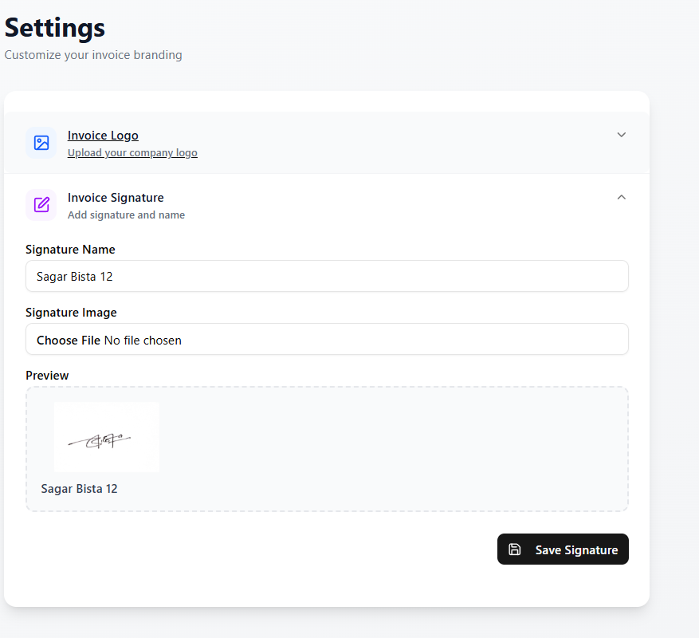

# Invoice Generator

A full-stack web application for creating, managing, and tracking professional invoices. Built with Next.js, MongoDB, and Auth.js.

## Features

- **User Authentication** - Secure email-based magic link login
- **Invoice Management** - Create, edit, and delete invoices
- **Dashboard Analytics** - Track total revenue, paid/unpaid invoices
- **Email Integration** - Send invoices directly to clients
- **PDF Generation** - Export invoices as PDF
- **Responsive Design** - Works on desktop and mobile

## Tech Stack

- **Framework**: Next.js 15 (App Router)
- **Language**: TypeScript
- **Database**: MongoDB with Mongoose
- **Authentication**: Auth.js (NextAuth)
- **Styling**: Tailwind CSS + shadcn/ui
- **Email**: Nodemailer (Gmail SMTP)
- **Deployment**: Vercel (recommended)

## Prerequisites

- Node.js 18+ 
- MongoDB database (local or Atlas)
- Gmail account for email service

## Screenshots


###Login - Enter your email to receive a magic link


###Dashboard - View your invoice statistics and recent activity


###Create Invoice - Fill in client details, items, and amounts


 Manage Invoices - Edit, delete, or mark invoices as paid

###Send Emails - Email invoices directly to clients


###Settings - Upload logo and signature for branding


## Environment Variables

Create a `.env.local` file in the root directory:

```env
# Authentication (required for Auth.js)
# Generate a secure random string using: openssl rand -base64 32
AUTH_SECRET=your-generated-secret-key-here

# Database
MONGODB_URI=your-mongodb-connection-string

# Email (Gmail)
GMAIL_USER=your-email@gmail.com
GMAIL_APP_PASSWORD=your-app-specific-password

# Optional: Set this for production
NEXTAUTH_URL=http://localhost:3000

💻 Installation

Clone the repository
git clone https://github.com/yourusername/invoice-generator.git
cd invoice-generator

Install dependencies

bash
npm install
Set up environment variables (see above)

Run the development server

bash
npm run dev
Open http://localhost:3000

🚦 Usage Guide
1. Login
Enter your email to receive a magic link

Click the link in your email to sign in

Complete your profile on first login

2. Create Invoice
Click "Create Invoice" button

Add client details (name, email, address)

Add items with descriptions, quantities, and prices

Set invoice date and due date

Save or send directly to client

3. Manage Invoices
View all invoices in the dashboard

Filter by status (paid, pending, overdue)

Edit or delete invoices

Mark invoices as paid

4. Send Emails
Click "Send Email" on any invoice

Email is sent with PDF attachment

Client receives professional template

5. Customize Settings
Upload company logo

Add signature image and name

Set default currency

📁 Project Structure
text
invoice-generator/
├── app/                    # Next.js app router
│   ├── api/                # API routes
│   │   ├── auth/           # Authentication endpoints
│   │   ├── invoice/        # Invoice CRUD operations
│   │   └── dashboard/      # Dashboard data
│   ├── dashboard/          # Dashboard page
│   ├── invoice/            # Invoice pages
│   │   ├── create/         # Create invoice
│   │   ├── edit/           # Edit invoice
│   │   └── paid/           # Mark as paid
│   └── login/              # Authentication page
├── components/             # Reusable UI components
│   ├── ui/                 # shadcn/ui components
│   ├── InvoiceForm.tsx     # Invoice creation form
│   └── DataTable.tsx       # Invoice list table
├── lib/                    # Utilities and configs
│   ├── auth.ts             # Auth.js configuration
│   ├── connectDb.ts        # MongoDB connection
│   └── utils.ts            # Helper functions
├── models/                 # MongoDB models
│   ├── invoice.model.ts    # Invoice schema
│   └── user.model.ts       # User schema
├── public/                 # Static assets
│   └── screenshots/        # App screenshots
└── styles/                 # Global styles
🚀 Deployment
Deploy on Vercel
https://vercel.com/button

Push your code to a GitHub repository

Import project to Vercel

Add all environment variables in Vercel dashboard

Deploy!

Environment Variables for Production
Make sure to add these in your Vercel dashboard:

AUTH_SECRET - Generate a new one for production

MONGODB_URI - Your production MongoDB connection string

GMAIL_USER - Your Gmail address

GMAIL_APP_PASSWORD - Your Gmail app password

NEXTAUTH_URL - Your production URL (e.g., https://invoice-generator.vercel.app)

📦 Available Scripts
bash
npm run dev          # Start development server
npm run build        # Build for production
npm start           # Start production server
npm run lint        # Run ESLint